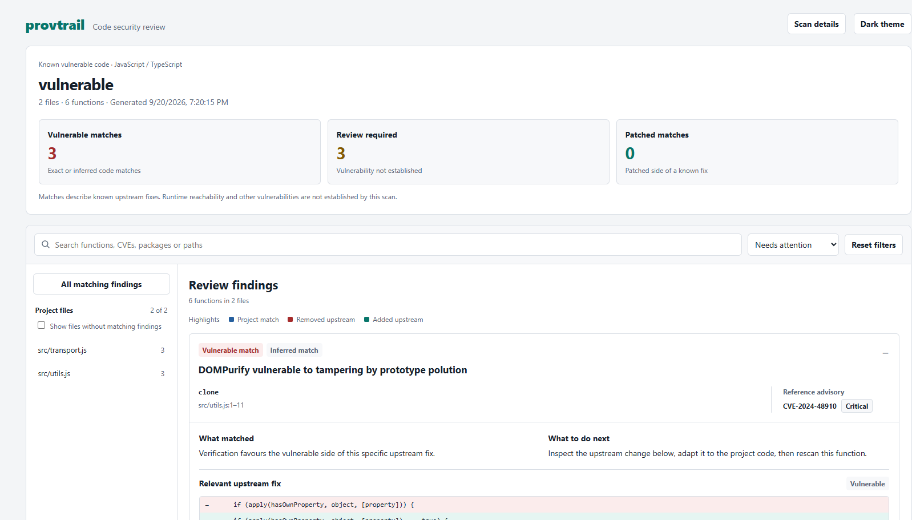
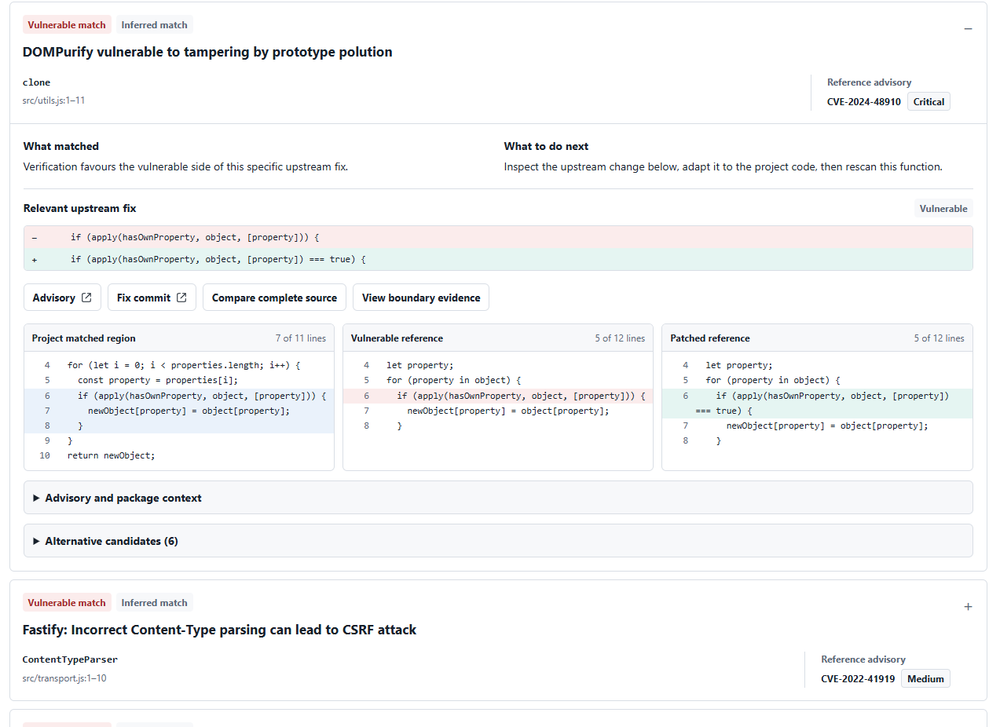

# ProvTrail

Find anonymous JavaScript and TypeScript code that matches known vulnerable implementations,
including copied, modified or AI-generated code.

## How it works

ProvTrail extracts functions from your JavaScript/TypeScript source, uses hashes
and local embedding search to find similar known vulnerable code, then compares
matches against both the vulnerable and patched versions of the upstream fix.
The HTML report separates vulnerable matches, patched matches, and cases needing
manual review, with advisory links and code comparisons to help you investigate.

**What you need:** Python 3.11+, Git, a JavaScript/TypeScript project, a populated
reference corpus, and the local embedding model (Qwen3-Embedding-0.6B by default).
Initial setup needs internet access to install dependencies and download model
weights; building a new corpus also requires a `GITHUB_TOKEN`. CPU execution is
supported, and Ollama is optional. The Quick Start below covers the setup.

## Report preview

Scan overview with finding counts, search, and file navigation:



Expanded finding with the upstream fix and project, vulnerable, and patched code:



## Quick Start

### 1. Install

Requires **Python 3.11+** and **Git**. CPU execution is supported.
Choose **one** of the following installation methods, then continue to step 2.

#### Option A: pipx — standalone command

With [pipx installed](https://pipx.pypa.io/latest/how-to/install-pipx.html), install
directly from GitHub. pipx manages its own environment; no activation is needed.

```sh
pipx install "git+https://github.com/ElsonNg/sc4079-fyp.git"
pipx ensurepath
```

Reopen your terminal, then run `provtrail --help` from any directory.

#### Option B: virtual environment — local checkout

Clone the repository and create an environment:

```sh
git clone https://github.com/ElsonNg/sc4079-fyp.git
cd sc4079-fyp
python -m venv .venv
```

Activate it with `source .venv/bin/activate` on macOS/Linux, or
`.\.venv\Scripts\Activate.ps1` in PowerShell, then install:

```sh
python -m pip install .
```

Use `python -m pip install -e .` instead if you plan to edit the tool.

#### Option C: wheel — existing package file

In an activated virtual environment, install your wheel file:

```sh
python -m pip install ./provtrail-0.1.0-py3-none-any.whl
```

### 2. Prepare the reference corpus

**The package does not bundle a populated corpus.** The corpus is a local database
of known vulnerable functions paired with their patched versions, plus the
advisories and source evidence used to identify them.

#### Configure access

Set `GITHUB_TOKEN` in your environment or in a `.env` file in the directory where
you run the command:

```dotenv
GITHUB_TOKEN=your_github_token
```

An environment variable takes precedence over the `.env` value. Building needs
network access to GitHub, OSV, and the npm registry. It does not require the
embedding model yet; that is set up in step 3.

#### Choose the build scope

**Choose `--package` or `--all` explicitly.** Running `provtrail corpus build`
without either option prints a usage error and fetches nothing. To start with
selected packages, repeat `--package` as needed:

```sh
provtrail corpus build --package axios --package express
provtrail corpus stats
```

To explicitly fetch all reviewed npm advisories instead:

```sh
provtrail corpus build --all
```

The full build can take time because each candidate needs source and release
evidence, and GitHub rate limits may delay requests. `--all` and `--package`
cannot be combined.

To discover package names and advisory counts before choosing, run:

```sh
provtrail corpus probe --limit 20
```

The probe ranks packages by reviewed advisory coverage; it does not check whether
their code will pass the build's evidence filters. A restricted corpus only gives
the scanner references from those selected packages.

**A successful build replaces the active corpus by default.** To add another
package while keeping existing entries, use `--append`, which merges and
deduplicates the results:

```sh
provtrail corpus build --package dompurify --append
```

#### What the build does

1. Fetches reviewed npm advisories from GitHub for the selected scope and skips
   withdrawn records.
2. Cross-checks package and version evidence with OSV, finds referenced fix
   commits, and checks npm release archives and commit ancestry to establish
   the affected-to-fixed release boundary.
3. Extracts changed JavaScript/TypeScript functions from each fix commit and its
   parent, pairing the vulnerable and patched code. Evidence filters reject
   unsuitable candidates, such as missing fix references, conflicting release
   evidence, or formatting-only changes.
4. Deduplicates accepted pairs, writes an integrity-checked snapshot, then
   replaces the active `corpus.db` with the completed database.

#### Check the result and continue

Progress messages show advisories, packages, and admitted or quarantined
candidates. The final attrition report lists accepted entry counts and rejection
reasons. Quarantined candidates are excluded from the scan corpus; not every
advisory produces an entry, and one advisory can produce several function pairs.

A successful build prints the snapshot and active database paths. Snapshots live
under `snapshots/<snapshot-id>/` in the [data directory](#data-and-configuration)
and include `source-manifest.json`, `attrition.json`, and `quarantine.json` for
inspection. If discovery fails, the resulting corpus is empty, or snapshot integrity
checks fail, the command exits with code **2** and leaves the active database
unchanged.

Confirm that `provtrail corpus stats` reports a nonzero entry count, then continue
to step 3 to build the embedding indexes. After rebuilding or extending the
corpus, run `provtrail corpus index --device cpu` again to refresh those indexes.

To choose a database location, pass `--db-path /path/to/corpus.db` to `corpus build`
and use that same option with `corpus stats`, `corpus index`, and `scan`.
`--snapshots-dir /path/to/snapshots` independently sets the build's snapshot
location; `PROVTRAIL_DATA_DIR` changes the default data directory for both.

Already have a populated corpus? Skip the build and use
`--db-path /path/to/corpus.db` with `corpus index`, `scan`, and `corpus stats`. Missing indexes are
built on the first scan. See [data locations](#data-and-configuration) to reuse
existing indexes too.

### 3. Set up the local embedding model

ProvTrail uses **Qwen/Qwen3-Embedding-0.6B** by default. The install includes
PyTorch and Sentence Transformers; the following command downloads the model
weights on first use, runs the model locally, and builds both search indexes:

```sh
provtrail corpus index --embed-model qwen3-embedding-0.6b --device cpu
```

Wait for indexing to finish before scanning. This setup works with every install
method above and requires no separate model server or Ollama installation.
Weights are cached for later runs. To choose their location, set `HF_HOME` before
running the command; see the [Hugging Face cache settings](https://huggingface.co/docs/huggingface_hub/en/package_reference/environment_variables#hf_home).
The model cache is separate from `PROVTRAIL_DATA_DIR`, which stores the corpus and indexes.

To use CPU for subsequent scans too, set this in each terminal session:

```sh
export PROVTRAIL_EMBEDDING_DEVICE=cpu  # macOS / Linux
```

```powershell
$env:PROVTRAIL_EMBEDDING_DEVICE = "cpu"  # PowerShell
```

Without this setting, PyTorch/Sentence Transformers selects an available device.
Use the same embedding model for indexing and scanning; `scan` also accepts
`--embed-model qwen3-embedding-0.6b`, which is already the default.

### 4. Scan a project

```sh
provtrail scan /path/to/project
```

Open `/path/to/project/.provtrail/latest-scan.html` in your browser. The same
directory contains `latest-scan.json` for automation. Repeat the scan to reuse
unchanged function results.

For a small example, see the [paired vulnerable/patched demo](examples/paired_demo/README.md).

## Documentation

### Reports and output flags

```sh
provtrail scan /path/to/project --output scan.json --sarif-output findings.sarif --ai-output findings.txt
provtrail report scan.json --verbose
```

| Flag | Command | Purpose |
|---|---|---|
| `--output PATH` | `scan` | Save scan JSON; the HTML defaults to the same path with an `.html` extension. |
| `--html-output PATH` | `scan` | Choose a separate HTML report path. |
| `--sarif-output PATH` | `scan`, `report` | Export actionable findings as SARIF 2.1.0. |
| `--ai-output PATH` | `scan`, `report` | Export compact text for review or an AI assistant; use `-` for stdout. |
| `--json` | `scan`, `report` | Print JSON instead of the terminal summary. |
| `--verbose` | `report` | Show advisory, version, score, and provenance details. |
| `--include-informational` | `report` | Include informational results in verbose or JSON output. |

`report` accepts either a saved JSON file or the scanned project directory, and
does not rerun detection. `--ai-output -` cannot be combined with `--json`.
SARIF and compact text include automatic vulnerability findings and manual reviews.

**Example SARIF result** (`findings.sarif`, one illustrative entry from
`runs[0].results`; the full file includes tool metadata and fingerprints):

```json
{
  "ruleId": "provtrail/manual-review",
  "level": "note",
  "message": {
    "text": "parseQuery: The vulnerable and patched edits are too similar to distinguish confidently."
  },
  "locations": [{
    "physicalLocation": {
      "artifactLocation": {"uri": "src/query.js", "uriBaseId": "%SRCROOT%"},
      "region": {"startLine": 12, "endLine": 28}
    }
  }]
}
```

**Example AI output** (`findings.txt`, the same illustrative finding):

```text
ProvTrail AI v1
root: /path/to/project
src/
  query.js:12-28 REVIEW confidence=high reason=The vulnerable and patched edits are too similar to distinguish confidently.
total=1 vuln=0 review=1
```

`REVIEW` requests manual inspection; `VULN` marks an automatic vulnerability finding.
Advisory IDs and package applicability appear when available. This is a text export
for an AI assistant to read; generating it does not call an LLM.

Scan/report exit code **1** means automatic vulnerability or manual-review findings
need attention; **0** means neither was reported. A clean result is limited by the
reference corpus and is not a guarantee that the project is vulnerability-free.

### Data and configuration

Data defaults to `%LOCALAPPDATA%\ProvTrail` on Windows and
`${XDG_DATA_HOME:-~/.local/share}/provtrail` on macOS/Linux. Set
`PROVTRAIL_DATA_DIR` to select a corpus/index directory. To reuse this checkout's
existing data, run one of these from the repository root:

```sh
export PROVTRAIL_DATA_DIR="$PWD/corpus/data"
```

```powershell
$env:PROVTRAIL_DATA_DIR = (Resolve-Path corpus/data).Path
```

Optional local Ollama opinions for manual-review findings are enabled with
`--explain-review`; they do not change the detector verdict or exit code.
Use `--help` on any command for the full option list.

See the [advanced guide](guides/advanced-usage.md) for corpus maintenance,
Ollama setup, detector configuration, and implementation details.

## Benchmark

The evaluation measures known-origin retrieval and vulnerable/patched discrimination:

| Dataset | Candidate pool | Purpose |
|---|---:|---|
| Tier 1 | 600 | Labelled targets from original vulnerable and fixed source revisions. |
| Tier 2 | 788 | Transformed vulnerable and patched snippets, including generated variants. |

These are candidate-pool sizes; validation is still in progress. Historical scores
should be read alongside the accepted subset, false positives, and abstentions.
See the [current validation status](eval/tier2/VALIDATION.md) for supported counts
and limitations, and [evaluation commands](eval/README.md) to reproduce experiments.
The [tool-comparison guide](docs/tool-comparison.md) covers comparisons with other scanners.
