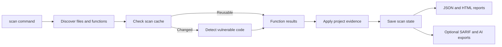
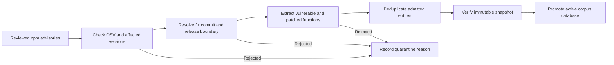

# Advanced usage and implementation

For installation and your first scan, start with the [Quick Start](../README.md#quick-start). Commands below assume the repository root.

A CLI tool for detecting JavaScript and TypeScript vulnerability clones against strictly
evidence-attributed vulnerable origins from the npm JavaScript/TypeScript ecosystem.

## CLI

Install in a virtual environment with `pip install -e .` for development or
`pip install dist/provtrail-*.whl` for a built wheel. The `provtrail` command
works outside the repository.

Runtime corpus data, indexes and snapshots default to the user's application data
directory (`%LOCALAPPDATA%/ProvTrail` on Windows or
`$XDG_DATA_HOME/provtrail` on Unix, falling back to `~/.local/share/provtrail`).
Set `PROVTRAIL_DATA_DIR` to use a different directory. Existing repository data
can be reused with `PROVTRAIL_DATA_DIR=corpus/data` from the repository root.

GitHub requests use `GITHUB_TOKEN` from the working directory's `.env` file. A token
already set in the process environment takes precedence. The `.env` file is ignored
by Git.

For engineers extending the tool, `src/provtrail/cli/main.py` defines arguments and dispatches
commands. Execution lives in `src/provtrail/cli/commands/scan.py`, `report.py`, and `corpus.py`.
The scan command calls `src/provtrail/pipeline/scanning/scanner.py`, which coordinates the
detector in `src/provtrail/pipeline/controller/region_detection.py`. The scan command then writes
the JSON and HTML reports. To follow a scan, read `scan_directory()` first:

1. `discovery.py` extracts JavaScript and TypeScript functions.
2. `cache.py` loads the snapshot and reusable detector results.
3. `scanner.py` reuses or detects each function, then applies project evidence.
4. `project_context.py` checks package manifests and imports.
5. `scanner.py` saves scan state and returns findings to the CLI for reporting.



Inside `RegionDetector.detect()`, follow hash lookup, region retrieval, verification,
boundary classification and lineage attribution in that order. The extracted
components live in `src/provtrail/pipeline/detection/`:

- `hashing.py` builds results for deterministic matches.
- `retrieval.py` groups and limits reference pairs for verification.
- `lineage.py` attributes source lineage and lists associated packages.
- `priority.py` chooses reporting priority from the resulting evidence.

The detector's `_verify_regions()` and `_classify_boundaries()` methods coordinate
the detailed checks. The optional local correspondence fallback runs only after
boundary classification remains uncertain and its eligibility gates pass.
Batch detection shares retrieval first, then rejoins `detect()` for each function.

Region verification lives in `src/provtrail/pipeline/detection/verification/`: `verifier.py`
coordinates scoring, `classification.py` decides boundary states, and the other
modules own structural/token scores, edit distance, evidence selection and fallbacks.

Provider calls live in two integration packages. `src/provtrail/corpus/integrations/` owns
GitHub, OSV and npm requests, verified release downloads, and SQLite storage.
`src/provtrail/pipeline/integrations/` owns embedding model loading, FAISS operations and Ollama
review requests. Controllers pass sessions and paths into these modules where needed.

Evaluation programs are grouped under `eval/tier1/`, `eval/tier2/`,
`eval/ablation/`, `eval/comparison_benchmark/` and `eval/fixtures/`. Retained
`scripts/` commands forward to them. Historical whole-function verification
results remain in `eval/` for reference. See `eval/README.md` for current build,
run and scoring commands.

For a small scan example with matched vulnerable and patched functions, see
[the paired demo](../examples/paired_demo/README.md). The larger
[scan demo](../examples/scan_demo/README.md) exercises harder transformations and
manual-review behavior.

The detector scans `.js`, `.jsx`, `.mjs`, `.cjs`, `.ts`, `.tsx`, `.mts`, and `.cts`
files with incremental scan state:

```bash
provtrail scan /path/to/project --output scan.json
```

The default scan summary uses an npm-audit-style layout. Every scan saves both the
structured result and a self-contained, offline HTML report:

```text
/path/to/project/.provtrail/latest-scan.json
/path/to/project/.provtrail/latest-scan.html
```

Open the HTML file directly in a browser to review vulnerable matches, uncertain
candidates, and recognised patched matches. The overview lists issues first, with
file navigation and shared search across functions, paths, packages and advisories.
Each expanded finding shows the relevant upstream edit, focused project code,
and a complete source comparison. Scores and advisory severity belong to the
selected fix boundary. Manual-review severity is labelled as reference impact
with relevance unconfirmed, and alternative candidates stay collapsed.

Use `--output scan.json` to move both artifacts
or `--html-output report.html` to override only the HTML path. Repeat the command to reuse
unchanged function verdicts. A scan exits non-zero when it finds a flagged or manual-review
result. Use `--json` to print the structured scan report to stdout.

### SARIF and AI exports

Both `scan` and `report` can export the actionable findings from the same scan JSON:

```bash
provtrail scan /path/to/project --sarif-output findings.sarif --ai-output findings.txt
provtrail report /path/to/project/.provtrail/latest-scan.json --sarif-output findings.sarif --ai-output findings.txt
provtrail report /path/to/project --ai-output - > findings.txt
```

SARIF 2.1.0 uses one result per vulnerable or manual-review function. Vulnerabilities
have `error` level and manual reviews have `note` level. The compact AI text groups
paths by directory and includes line ranges, advisory IDs, package applicability,
confidence, and a short evidence reason. Both formats include manual-review findings
even when an optional Ollama second opinion dismisses them. Informational and no-match
functions are omitted. `--ai-output -` prints only the AI report to stdout, with scan
progress on stderr, and cannot be combined with `--json`. Existing scan JSON, HTML,
summary output, and exit codes remain the same unless an export is requested.

### Local second opinions for manual review

Manual-review findings can optionally include an independent relevance review from a local
Ollama model. Flagged findings do not invoke the LLM. Install the model once, keep Ollama
running, and opt in when scanning:

```bash
ollama pull qwen3:8b
provtrail scan /path/to/project --explain-review
```

The model compares the advisory's security mechanism with the project, vulnerable, and
patched code. It assigns relevance tier 1 (totally irrelevant), 2 (potentially relevant),
or 3 (definitely relevant), shown as an LLM verdict of Dismissed, Needs review, or Flagged.
The HTML presents these as optional advice: Likely unrelated, Uncertain, or Investigate.
Detector scores and confidence are deliberately excluded from its prompt so this remains
a second opinion. The LLM verdict does not change the deterministic finding status,
severity, scores, process exit code, or recommendations. If Ollama is unavailable or
returns invalid output, the scan completes, records the explanation as unavailable, and
prints a warning.

Successful explanations are content-addressed and reused from
`.provtrail/review-explanations.json`. The cache key includes the model, prompt version,
and evidence bundle, so changed evidence is explained again. The generated explanation is
also embedded in the JSON and self-contained HTML artifacts.
New opinions record the fix boundary they assessed. The HTML asks for regeneration
when an older opinion cannot be tied to the currently selected boundary.

Use `--ollama-model`, `--ollama-host`, and `--ollama-timeout` to override the defaults.
`PROVTRAIL_OLLAMA_MODEL` and `OLLAMA_HOST` provide environment-variable equivalents for
the model and host. The default endpoint is local (`http://127.0.0.1:11434`); provtrail
does not send review evidence to a hosted model by default. Network access is needed only
to install or update the Ollama model. Once the model and vulnerability corpus are present,
scanning, explanation generation, and viewing the report work offline.

Inspect CVE, affected-version, fixed-version, score, and provenance details without
rerunning the detector:

```bash
provtrail report /path/to/project --verbose
```

The report command also accepts a saved JSON file directly. Use `--include-informational` to
include informational functions in the detailed output. Rebuild an older corpus once to
backfill advisory titles, descriptions, and canonical links used by the HTML report.
Corpus maintenance commands are:

```bash
provtrail corpus stats
provtrail corpus build --package axios --package express
provtrail corpus ingest-klaban
provtrail corpus index
```

`corpus build` requires an explicit scope: repeat `--package` to select packages,
or use `--all` to discover every reviewed, non-withdrawn npm advisory. The options
are mutually exclusive; omitting both fails before discovery. It
admits entries only after GitHub Advisory Database, OSV, npm tarball, repository, release,
commit-ancestry, focused-diff, parser, and executable-AST checks agree. `--package`
restricts coverage and does not bypass any check. Severity, popularity, maintenance,
and the post-admission high-impact cohort are metadata rather than admission gates.



Successful builds are first written to a versioned directory under
`PROVTRAIL_DATA_DIR/snapshots/`. The database, native/type-erased retrieval map, source and
artifact hashes, policy manifest, attrition report, quarantine ledger, and complete and
high-impact cohort counts are checked before `current.json` and the active database are
replaced atomically. Failed builds do not promote a partial snapshot.

The HTML labels automatic detections as **Exact native match** or **Inferred match**.
The **View boundary evidence** dialog shows the source languages, recorded hash
evidence, and scores for the selected fix. Similarity scores describe code
correspondence, not the probability that the application is exploitable.

Corpus admission establishes provenance and source/patch correspondence. Independent
security-behaviour validation is still in progress: see the [validation status](../eval/tier2/VALIDATION.md)
for executable evidence, source-review evidence, failures and unresolved cases.
Neither corpus admission nor a similarity score guarantees application exploitability.
The immutable provenance and quarantine artifacts are retained for evaluation.

The separate `corpus ingest-klaban` evaluation utility is not used by `corpus build`.
It reads a local manually confirmed Klaban dataset (pass its path or place it under
`PROVTRAIL_DATA_DIR/raw/kluban/extracted/`), replaces
previously imported Klaban rows in `PROVTRAIL_DATA_DIR/corpus.db`, and builds both the
whole-function and AST-region FAISS embedding indexes. Pass `--skip-index` to perform
only the SQLite import, or `--db-path` and the index-directory options to write isolated
artifacts.
Use `--device cpu` when the platform's MPS/CUDA backend is unavailable or unstable.
Use `--skip-region-index` when only the whole-function FAISS index is required.

Long functions are indexed with bounded, diagnostic-aware windows so code around the
security fix remains retrievable even when it occurs far beyond the function prefix.
Kluban overlap analysis and benchmarking are deferred to the later evaluation phase. The
existing evaluation utility can be run independently with:

```bash
python -m eval.tier1.evaluate_klaban_retrieval --k 10
```

The evaluator prints running hit rates, elapsed time, and ETA every 10 queries. Use
`--progress-every 1` for every query or `--progress-every 0` for quiet operation.

Generated embedding indexes and local scan state are intentionally excluded from Git.
